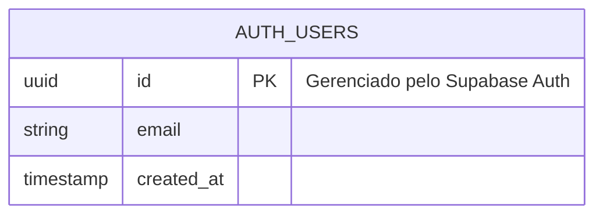

# 🗺️ SCHEMA.md - Base Template Universal

> **Fonte de Verdade:** Este documento é o GPS do sistema. Mantenha-o atualizado sempre que houver mudanças estruturais no banco de dados.

---

## 📊 Status do Banco de Dados

**Estado Atual:** ✅ **Limpo e Pronto para Uso**  
**Última Atualização:** 2026-05-09  
**Versão da Migration:** `20260509000001_initial_setup`

---

## 🧩 Diagrama de Relacionamentos



---

## 🛠️ Extensões Instaladas

| Extensão | Versão | Schema | Descrição |
|----------|--------|--------|-----------|
| **uuid-ossp** | Latest | `extensions` | Geração de UUIDs (v4) para chaves primárias |
| **pg_net** | Latest | `extensions` | Requisições HTTP assíncronas (webhooks, integrações) |
| **vector** (pgvector) | Latest | `extensions` | Suporte a embeddings e busca semântica (IA/ML) |

---

## 🔧 Funções Globais

### `update_timestamp()`

**Descrição:** Atualiza automaticamente o campo `atualizado_em` em qualquer tabela.

**Uso:**
```sql
-- Adicione este trigger em todas as tabelas que rastreiam modificações
CREATE TRIGGER set_timestamp
BEFORE UPDATE ON sua_tabela
FOR EACH ROW
EXECUTE FUNCTION update_timestamp();
```

**Exemplo Completo:**
```sql
CREATE TABLE exemplo (
    id UUID PRIMARY KEY DEFAULT extensions.uuid_generate_v4(),
    nome TEXT NOT NULL,
    criado_em TIMESTAMPTZ NOT NULL DEFAULT timezone('utc'::text, now()),
    atualizado_em TIMESTAMPTZ NOT NULL DEFAULT timezone('utc'::text, now())
);

-- Adiciona o trigger de atualização automática
CREATE TRIGGER set_timestamp
BEFORE UPDATE ON exemplo
FOR EACH ROW
EXECUTE FUNCTION update_timestamp();
```

---

## 📋 Tabelas do Sistema

### `auth.users` (Gerenciado pelo Supabase)

Tabela de autenticação gerenciada automaticamente pelo Supabase Auth.

**Campos Principais:**
- `id` (UUID) - Chave primária
- `email` (TEXT) - Email do usuário
- `created_at` (TIMESTAMPTZ) - Data de criação
- `updated_at` (TIMESTAMPTZ) - Data de atualização

**⚠️ IMPORTANTE:** Nunca modifique esta tabela diretamente. Use as APIs do Supabase Auth.

---

## 🔐 Row Level Security (RLS)

**Status:** ⚠️ Nenhuma política configurada (banco limpo)

**Protocolo Obrigatório:**
Quando você criar sua primeira tabela:

1. **SEMPRE habilite RLS:**
   ```sql
   ALTER TABLE sua_tabela ENABLE ROW LEVEL SECURITY;
   ```

2. **Crie políticas apropriadas:**
   ```sql
   -- Exemplo: Usuários só veem seus próprios dados
   CREATE POLICY "Users can view their own data"
   ON sua_tabela
   FOR SELECT
   USING (auth.uid() = user_id);

   -- Exemplo: Usuários só inserem seus próprios dados
   CREATE POLICY "Users can insert their own data"
   ON sua_tabela
   FOR INSERT
   WITH CHECK (auth.uid() = user_id);
   ```

---

## 🚀 Próximos Passos

### Como Criar Sua Primeira Tabela

1. **Nunca use SQL manual.** Sempre gere uma migration:
   ```powershell
   npx supabase migration new create_sua_tabela
   ```

2. **Edite o arquivo gerado em `./supabase/migrations/`:**
   ```sql
   CREATE TABLE sua_tabela (
       id UUID PRIMARY KEY DEFAULT extensions.uuid_generate_v4(),
       user_id UUID REFERENCES auth.users(id) ON DELETE CASCADE,
       nome TEXT NOT NULL,
       criado_em TIMESTAMPTZ NOT NULL DEFAULT timezone('utc'::text, now()),
       atualizado_em TIMESTAMPTZ NOT NULL DEFAULT timezone('utc'::text, now())
   );

   -- Habilita RLS
   ALTER TABLE sua_tabela ENABLE ROW LEVEL SECURITY;

   -- Adiciona políticas
   CREATE POLICY "Users can manage their own data"
   ON sua_tabela
   USING (auth.uid() = user_id)
   WITH CHECK (auth.uid() = user_id);

   -- Adiciona trigger de atualização
   CREATE TRIGGER set_timestamp
   BEFORE UPDATE ON sua_tabela
   FOR EACH ROW
   EXECUTE FUNCTION update_timestamp();
   ```

3. **Aplique a migration:**
   ```powershell
   npx supabase db reset
   ```

4. **Sincronize os tipos TypeScript:**
   ```powershell
   .\sync-db.ps1
   ```

5. **Atualize este SCHEMA.md:**
   - Adicione a tabela ao diagrama Mermaid
   - Documente relacionamentos
   - Liste políticas RLS

---

## 📚 Referências

- [Supabase Database Documentation](https://supabase.com/docs/guides/database)
- [PostgreSQL Extensions](https://www.postgresql.org/docs/current/contrib.html)
- [Row Level Security](https://supabase.com/docs/guides/auth/row-level-security)
- [Mermaid ER Diagrams](https://mermaid.js.org/syntax/entityRelationshipDiagram.html)

---

**🎯 Lembre-se:** Este é um **Template Universal**. Não adicione lógica de negócio aqui. Mantenha apenas infraestrutura reutilizável.
